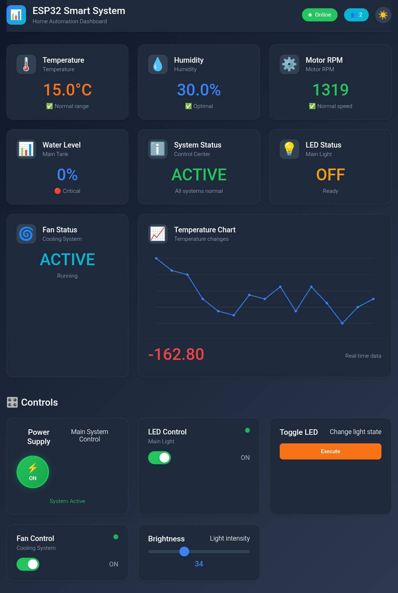

# 📊 ESP32Dashboard

A modern, lightweight, and powerful dashboard library for ESP32 using WebSocket and auto-generated UI — no HTML required.

---


---

## 🚀 Features

- Real-time WebSocket communication  
- Live data cards: Temperature, Humidity, RPM, Chart, Percentage, Status, Custom  
- Interactive controls: Switch, Button, Slider, Power Button  
- Fully self-contained web UI (HTML/CSS/JS inside ESP32)  
- Built-in serial monitoring and system status  
- Fast and easy setup  

---

## 📦 Installation

1. Clone or download this repo:  
`git clone https://github.com/ErfanGanji87/ESP32Dashboard.git`
2. In Arduino IDE:  
   `Sketch > Include Library > Add .ZIP Library`  
   Or manually copy the `ESP32Dashboard` folder into your `Arduino/libraries` directory.

---

## 🧠 Getting Started

### Include and Initialize

```cpp
#include "ESP32Dashboard.h"

ESP32Dashboard dashboard;

void setup() {
  dashboard.begin("SSID", "PASSWORD");
  dashboard.setTitle("ESP32 Dashboard", "Live Monitoring");
  dashboard.setUpdateInterval(1000);  // Update rate in ms
}
```

---

## 📊 Adding Dashboard Cards

### Temperature Card

```cpp
dashboard.addTemperatureCard("Temperature", []() {
  return 25.0 + random(-50, 50) / 10.0;
});
```

### Humidity Card

```cpp
dashboard.addHumidityCard("Humidity", []() {
  return 50.0 + random(-100, 100) / 10.0;
});
```

### RPM Card

```cpp
dashboard.addMotorRPMCard("Motor RPM", []() {
  return 1000 + random(-100, 100);
});
```

### Percentage Card

```cpp
dashboard.addPercentageCard("Water Level", "Main Tank", []() {
  return 60;
}, "blue");
```

### Custom Status Card

```cpp
dashboard.addCustomCard("LED Status", "Main Light", []() {
  return ledState ? "ON" : "OFF";
}, []() {
  return ledState ? "Running" : "Off";
}, "yellow", "💡");
```

### Chart Card

```cpp
dashboard.addChartCard("Temp Chart", "Live temperature", []() {
  return temperature;
}, "red", 20);
```

---

## 🎮 Adding Interactive Controls

### Power Button

```cpp
dashboard.addPowerButton("System Power", "Main Control", [](bool state) {
  systemPower = state;
});
```

### Switch

```cpp
dashboard.addSwitch("LED Toggle", "Turn on/off LED", [](bool state) {
  digitalWrite(LED_BUILTIN, state);
});
```

### Button

```cpp
dashboard.addButton("Flash LED", "Test light", []() {
  digitalWrite(LED_BUILTIN, !digitalRead(LED_BUILTIN));
});
```

### Slider

```cpp
dashboard.addSlider("Brightness", "Adjust level", [](int value) {
  analogWrite(ledPin, map(value, 0, 100, 0, 255));
}, 0, 100, "green");
```

---

## 🛠 Runtime Updates

Update any card at runtime with:

```cpp
dashboard.updateCard("custom_0", "OFF", "LED is off");
```

> IDs are auto-generated in order:  
> `temperature_0`, `status_0`, `custom_0`, etc.

---

## 🧰 Utility Functions

| Function                 | Purpose                             |
|--------------------------|-----------------------------------|
| `getLocalIP()`           | Get device IP address              |
| `getConnectedClients()`  | Number of connected clients       |
| `enableSerialMonitoring()` | Enable debug serial output       |
| `printSystemStatus()`    | Print all current variable states |
| `setSerialBaudRate(baud)`| Set serial baud rate               |
| `setWiFiCredentials(ssid, pass)` | Change WiFi credentials    |

---

## 🔌 WebSocket Events

### Detect client connect/disconnect

```cpp
dashboard.onClientConnect = []() {
  Serial.println("Client connected!");
};

dashboard.onClientDisconnect = []() {
  Serial.println("Client disconnected!");
};
```

### Handle custom WebSocket messages

```cpp
dashboard.onCustomMessage = [](String type, String payload) {
  Serial.printf("Received %s: %s
", type.c_str(), payload.c_str());
};
```

---

## 🔁 Main Loop

```cpp
void loop() {
  dashboard.loop();

  static unsigned long last = 0;
  if (millis() - last > 5000) {
    dashboard.printSystemStatus();
    last = millis();
  }
}
```
---

## 📄 License

This library is licensed under the MIT License.  
© 2025 [Erfan Ganji](https://github.com/ErfanGanji87/ESP32Dashboard)

---

> 🔥 Designed to simplify real-time ESP32 monitoring with style and speed.
